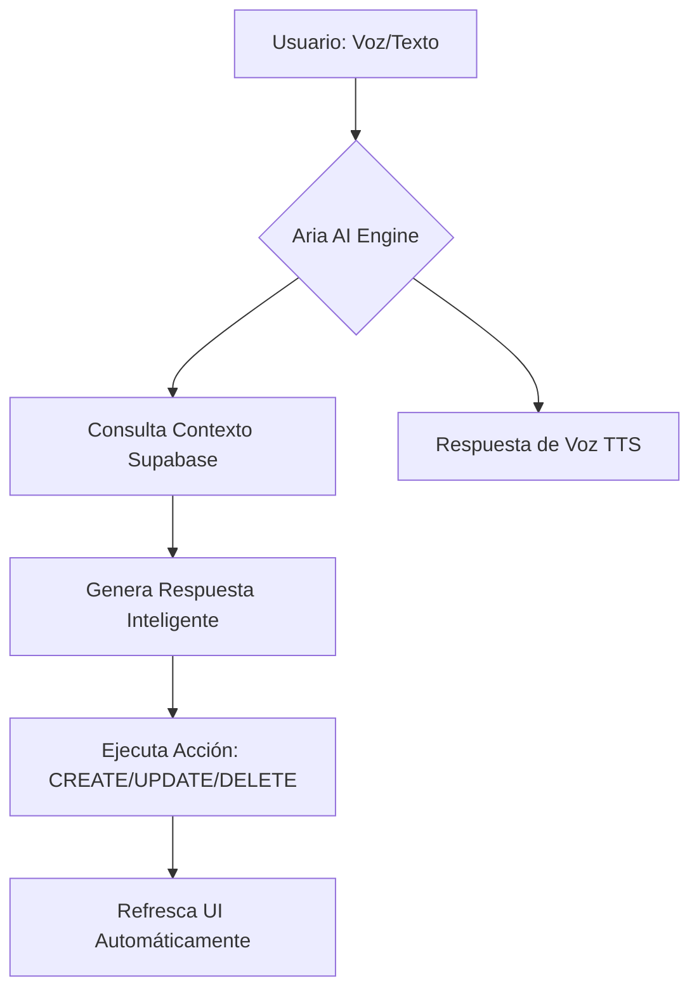
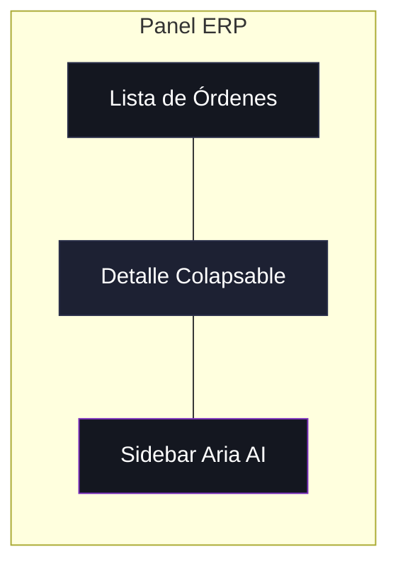
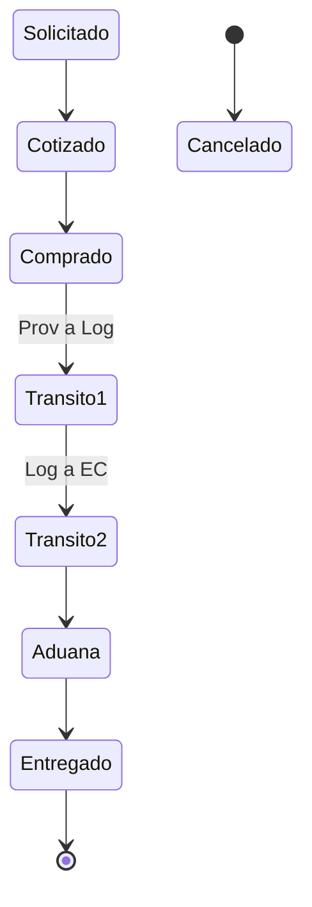

# 📘 Manual de Funcionalidades ERP — AGN Autopartes

Este documento detalla las capacidades avanzadas del sistema ERP, diseñado para centralizar la gestión de órdenes, optimizar la inteligencia de negocio y facilitar la interacción mediante IA descriptiva y voz.

## 🤖 Aria: Asistente de Inteligencia Artificial
Aria no es solo un chat; es un motor de ejecución con contexto persistente.
- **Contexto de Base de Datos:** Aria "lee" el estado actual de las órdenes antes de responder, permitiendo actualizaciones precisas como "actualiza el costo de la orden de Juan".
- **Reconocimiento de Voz Nativo:** Integración directa con `Web Speech API`. Permite el dictado de órdenes complejas (ej. "Crea una orden para Pedro, Ford F150, necesita un radiador...") sin usar el teclado.
- **Síntesis de Voz (TTS):** Aria puede vocalizar sus respuestas para una operación manos libres.

## 📈 Módulo de Reportes e Inteligencia
El sistema ha evolucionado de un simple listado a una plataforma de análisis de datos.
- **Filtros Multidimensionales:** Permite cruzar datos por rango de fechas, marcas de vehículos, modelos específicos y estados de flujo (desde solicitado hasta entregado).
- **Cálculo de Rentabilidad:** La tabla de reportes calcula automáticamente la ganancia por orden basándose en el precio de venta y el costo FOB ingresado.
- **Exportación Premium:** Generación de archivos CSV con codificación BOM (Byte Order Mark) para compatibilidad nativa con Microsoft Excel, respetando columnas, tildes y caracteres especiales.

## 🛠️ Gestión de Órdenes y Control Manual
El panel central permite un control granular de cada proceso:
- **Identificadores Únicos (ORD-X):** Cada orden posee un ID legible que facilita la comunicación interna.
- **Edición en Tiempo Real:** Todos los campos de la orden (VIN, Tracking, Financieros) son editables manualmente con guardado instantáneo en Supabase.
- **Panel de Detalles Colapsable:** Optimización del espacio mediante un toggle lateral que permite expandir o contraer la información de la orden según la necesidad del usuario.

---

## 📊 Gráficos y Flujos de Trabajo

### 1. Flujo de Interacción de Aria

### 2. Jerarquía de la Interfaz (Layout Premium)

### 3. Ciclo de Vida de una Orden

---

## 📄 Conclusiones
El sistema AGN Autopartes integra lo último en tecnología web para ofrecer una herramienta robusta, escalable y, sobre todo, fácil de usar a través de la voz y la inteligencia artificial.
